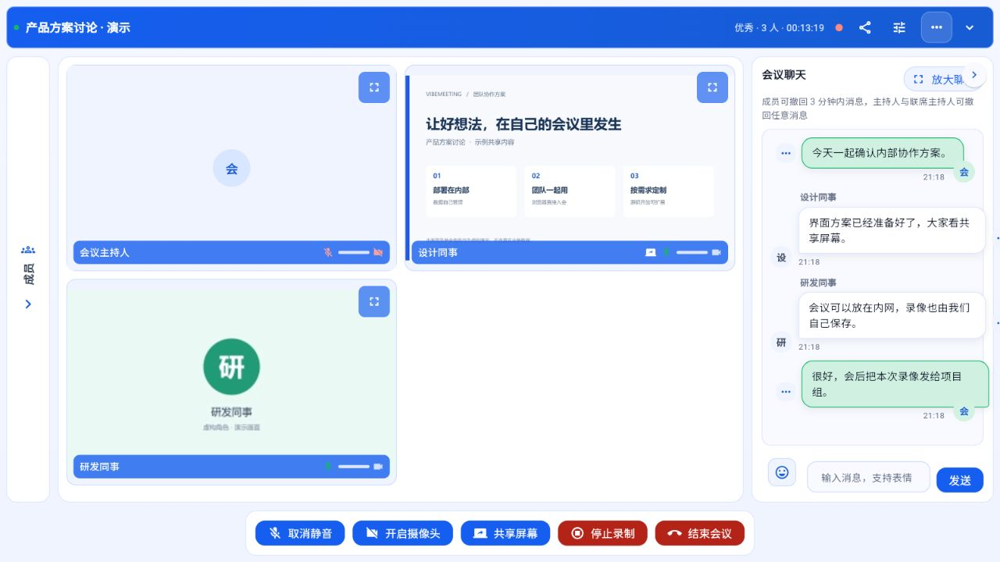
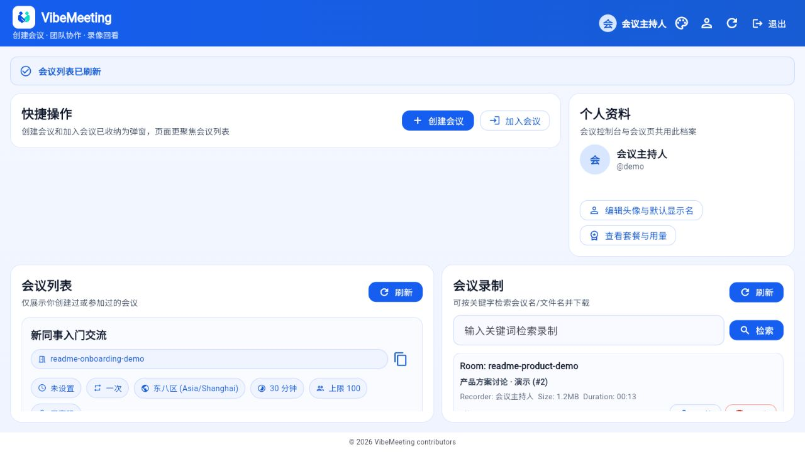

<div align="center">


# VibeMeeting 开源在线会议

**把会议部署在自己的环境里，打开浏览器即可开会，不按人数、时长收取软件许可费用。**


[](./LICENSE)

[项目动机](#项目动机) · [使用体验与Feature](#使用体验与Feature) · [一键安装](#一键安装) · [文档](#文档与开发) · [许可证与联系](#许可证与联系)

</div>

## 项目动机

会议聊的是自己的业务，工具也应该由自己掌握。VibeMeeting 面向希望自主部署、控制成本、按需改造的团队：

- **内部讨论，留在内部。** 会议服务可以部署在单位内网，账号、访问权限和录像存储由自己管理。
- **免费开源，不按人数购买许可。** 个人、团队和商业场景都可以使用；只需承担自己的服务器、存储和网络等运行成本。
- **流程合适，才用得顺手。** 完整源码开放，可以调整界面、接入内部系统，或按需扩展语音转写与 Agent。

从浏览器入会，到共享方案、会后回看，先把日常会议做好，再把它变成适合自己团队的工具。

## 功能概览

| 能力 | 当前提供 |
| --- | --- |
| 账号与会议 | 注册登录、创建和管理会议、会议链接入会、会议等候室 |
| 实时沟通 | 摄像头、麦克风、屏幕共享、文字聊天 |
| 主持人管理 | 主持人 / 联席主持人 / 参会者角色、成员管理和静音控制 |
| 会议录制 | 启动 / 停止录制、MP4 文件、存储路径配置 |
| 浏览器界面 | Flutter Web、可收起的会议顶部信息、桌面及移动浏览器 |
| 部署与数据 | Docker / 本地启动、随机初始密码、独立数据库和持久化录像 |


## 使用体验与Feature

**让讨论内容成为主角。** 共享方案、面对面交流、同步文字消息；顶部信息可收起，给会议舞台留出更多空间。



**把会议和回看放在同一个地方。** 创建会议、邀请同事，结束后查找和下载录像，让临时沟通也有迹可循。




## 一键安装

### 方式一：pip 安装与直接运行

需要 Python 3.10–3.13，以及已启动的 Docker（Linux 容器、Compose v2.20+）。

```bash
pip install -i https://pypi.org/simple  vibemeeting
vibemeeting
```

访问 `http://127.0.0.1:8000`。用户名 `admin`，初始随机密码保存在用户主目录的 `.vibemeeting/.runtime/local.env`。音视频和录制服务一起启动，按 Ctrl+C 停止；账号和录像保留。

```bash
vibemeeting --help
vibemeeting --version
vibemeeting --port 18000 --data-dir ./meeting-data
vibemeeting info --data-dir ./meeting-data
```

命令不在 PATH 时可使用 `python -m vibemeeting`。数据目录、升级与 PyPI 发布步骤见 [pip 安装指南](./docs/run/pip-install.md)。

### 方式二：从源码一键启动

下面的 Docker / 本地脚本方式需要先[下载完整源码](https://github.com/changkaiyan/vibemeeting/archive/refs/heads/main.zip)，或克隆仓库并进入项目根目录：

```bash
git clone https://github.com/changkaiyan/vibemeeting.git
cd vibemeeting
```

> 首次运行需要联网下载镜像、依赖与 Flutter SDK，并构建网页。建议为 Docker 预留至少 4 CPU、4 GB 内存用于录制。

| 方式 | Windows | Linux / macOS | 前置依赖 |
| --- | --- | --- | --- |
| Docker（推荐） | 双击 `run-docker.cmd` | `bash run-docker.sh` | 已启动的 Docker（Linux 容器）与 Compose v2.20+ |
| 本地 | 双击 `run-local.cmd` | `bash run-local.sh` | Python 3.10+、Git、Docker 与 Compose |

本地方式在本机运行 Django 和网页构建，音视频及录制组件使用 Docker。两种方式都会自动迁移数据库、初始化管理员并启动会议录制服务。

### 方式三：Docker 启动

```powershell
# Windows PowerShell
powershell -NoProfile -ExecutionPolicy Bypass -File .\run-docker.ps1
```

```bash
# Linux / macOS
bash run-docker.sh
```

访问 `http://127.0.0.1:8080`。用户名 `admin`，初始随机密码位于 `.runtime/docker.env` 的 `DJANGO_SUPERUSER_PASSWORD`。

Docker 版停止：Windows 执行 `.\run-docker.ps1 --stop`，Linux/macOS 执行 `bash run-docker.sh --stop`。查看日志使用相应入口的 `--logs` 参数。

重复运行启动脚本会复用配置与数据；源码更新后重新运行即可安装依赖或重建网页。录像保存在 `.runtime/recordings/`，停止服务不会删除录像和数据库。初始密码不会在后续启动时重置用户已修改的密码。

端口冲突、自定义端口、目录说明和局域网部署请阅读 [一键安装运行指南](./docs/run/one-click.md)。Windows 已完成两种方式的实际验证；Linux/macOS 入口已做 Shell 语法验证，尚未在对应系统实机验证。


## 文档与开发

| 资料 | 内容 |
| --- | --- |
| [文档总览](./docs/README.md) | 运行、设计及历史资料索引 |
| [pip 安装](./docs/run/pip-install.md) | Python 包、直接运行、数据与发布 |
| [一键安装](./docs/run/one-click.md) | 启动、停止、账号与录制 |
| [本地开发](./docs/run/development.md) | 开发环境、联调及可选集成 |
| [接口与配置](./docs/run/api.md) | API、OAuth、管理员策略及环境变量 |
| [部署说明](./docs/run/deployment.md) | 服务部署和运行配置 |
| [HTTPS 指南](./docs/run/https-testing.md) | 可信证书与跨设备访问 |
| [流程测试](./docs/run/testing.md) | 安装验收与自动化回归 |
| [发布与隐私](./docs/run/release-privacy.md) | 源码审查、历史与安全导出 |

欢迎通过 [Issues](https://github.com/changkaiyan/vibemeeting/issues) 报告问题、提出需求，或提交带测试的 Pull Request。提交日志和截图前请先删除个人信息和密钥；敏感漏洞请按 [安全说明](./SECURITY.md) 处理。

## 许可证与联系

本项目采用标准 [Apache License 2.0](./LICENSE)。使用、修改和分发时应遵守许可证中的保留版权声明、附带许可证、标明修改等要求，并明确声明Copyright。
欢迎就商业合作、团队部署、定制开发和技术支持自愿联系作者，也可通过 [GitHub Issues](https://github.com/changkaiyan/vibemeeting/issues) 交流。

第三方组件保留各自许可证和版权声明；本项目的许可不改变第三方权利。

## 致谢与文档参考

感谢 Django、Flutter、LiveKit、Redis 和 Coturn 等项目提供基础能力。
