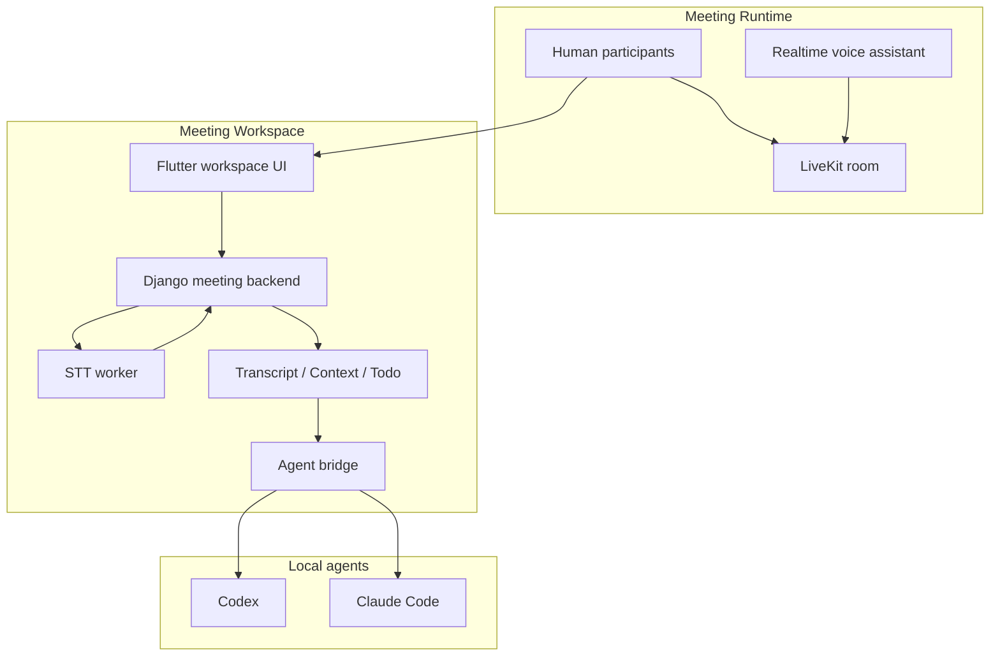

# AI Workflows Overview

## 总览

当前项目有两条核心 AI workflow。

### 1. 实时语音助手

定位：

- 会里的一个 AI 与会成员
- 目标是低时延语音到语音交互
- 用户把它当作“在场的人”直接说话

特征：

- 强实时
- 面向当前 turn
- 重在听说交互与即时反馈
- 通过会议里的 `AI 管控` 启停

输出：

- 语音回复
- 会中即时问答
- 轻量现场协作

### 2. 会议工作区

定位：

- 会中近实时转写与上下文沉淀系统
- 目标是把会议内容结构化成可操作上下文
- 后续承载 todo 提取、任务拆解、agent 派发

特征：

- near-realtime
- 面向持续上下文累积
- 重在文字、context、artifact、todo
- 通过工作区 STT 和 agent bridge 协作

输出：

- partial/final transcript
- context 条目
- 待办与行动项
- 派发给本地 agent 的任务

## 为什么要拆成两条

这两条 workflow 的延迟目标、数据模型、交互方式都不同。

实时语音助手关注：

- 说一句立刻听懂
- 很快回一句
- 尽量少依赖工作区状态

会议工作区关注：

- 连续吸收会议上下文
- 让用户可选取上下文去 offload
- 让系统提炼任务并沉淀结果

如果硬合并，会出现三个问题：

- 语音交互状态机会污染 transcript/context 逻辑
- 工作区的持久化和结构化处理会拖慢实时对话
- 后续 agent 派发与 notebook/dashboard 难以保持模块边界

## 当前系统架构

## 边界定义

### 实时语音助手负责

- 订阅会议实时音频
- 低延迟语音理解
- 语音回复与会中互动
- 处理“像一个人来参会”的体验

### 实时语音助手不负责

- 完整 transcript 持久化
- 工作区 context 管理
- todo 提取
- agent 任务编排

### 会议工作区负责

- 会议语音近实时转写
- transcript/context 沉淀
- todo/action item 提取
- 与 agent bridge 对接
- 输出 artifact 与执行反馈

### 会议工作区不负责

- 扮演实时说话的 AI 成员
- 低时延语音到语音生成
- 会议内语音播报链路

## 当前实现映射

### 实时语音助手

当前主路径：

- Django `realtime_audio_ws`
- LiveKit 实时音频
- AI 管控配置的语音模型链路

说明：

- 这是独立于工作区 STT 的一条链
- 不应该被 `stt_worker` 或 `agent_bridge` 污染

### 会议工作区

当前主路径：

- Flutter `meeting_room/workspace_stt/`
- Django `conference/speech_to_text/`
- `services/stt_worker/`
- `conference/meeting_context/`
- `conference/meeting_agent_bridge/`

说明：

- 这是 transcript/context/agent automation 的主承载面
- `faster-whisper` 仍可用作 fallback
- 云端 STT 当前按 `1354869` 路线推进

## 未来演进

### 实时语音助手

继续优化：

- 更稳的语音 turn 检测
- 更自然的插话与打断
- 更好的会中角色扮演

### 会议工作区

继续优化：

- 一键启用 near-realtime STT
- 自动上下文切片
- 自动 todo 提取
- 轻任务即时派发
- agent dashboard / notebook / memory 挂接

## 关联设计文档

- [工作区近实时 STT 设计](./near-realtime-stt-design.md)
- [流式 STT worker 设计](./streaming-stt-worker-design.md)
- [火山云端 STT 设计](./volcengine-cloud-stt-design.md)
