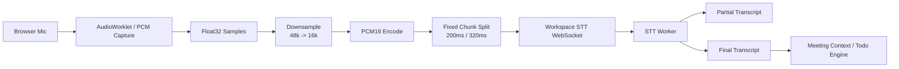

# Near Realtime STT Design

## 目标

本设计面向 `会议工作区` 的近实时语音转写链路，不面向 `实时语音助手`。

目标：

- 在会议进行中持续将语音转成文字进入 context 区
- 支持自动提取 summary / todo / decision / risk
- 支持将轻任务会中立即派发给 agent bridge
- 明确与实时语音助手解耦，避免污染其现有音频链路

非目标：

- 不替代实时语音助手
- 不复用实时语音助手的前端采集控制器
- 不复用实时语音助手的 WebSocket ingress / turn 状态机
- 不要求子秒级语音对话时延

## 产品边界

### 会议工作区 STT

负责：

- 近实时采集会议语音
- 输出 `partial transcript`
- 在语句边界输出 `final transcript`
- 将 final transcript 写入会议 transcript 和 context
- 触发自动总结、todo 提取、任务路由

特点：

- 目标时延为秒级
- 稳定性优先于极限低延迟
- 以文本沉淀和工作流推进为中心

### 实时语音助手

负责：

- 作为 AI 与会者进行即时互动
- 使用语音或短文本进行快速反馈
- 处理被点名、被提问、即时讨论等场景

特点：

- 强依赖低时延音频回路
- 以会中对话体验为中心

## 解耦原则

Flutter 侧必须保持两条链路独立：

1. `meeting_room/realtime bot/*`
2. `meeting_room/workspace_stt/*`

共享层只允许出现在：

- 会议 id / token / 基础 API client
- transcript / context / output 的结果展示层

禁止共享：

- 音频采集控制器
- 音频上传 WebSocket
- VAD / turn 状态机
- provider 选择逻辑

## 当前瓶颈

当前 workspace STT 不是严格意义上的 streaming：

- Flutter 侧使用 `MediaRecorder` 按 1 秒粒度输出 `audio/webm`
- worker 侧 `faster-whisper` 在 `finalize()` 之前基本不做真实转写
- `partial_transcript` 主要是占位信息而不是真字幕

这导致用户体感更像“录音结束后出结果”，而不是会中近实时字幕。

补充：

- 当前 `finalize()` 二次全量转写已经被移除
- 但 `partial decode` 仍存在重复计算，当前仍处于性能优化中

## 目标架构

### Phase 1

先完成 Flutter 侧结构解耦，但暂时保持现有行为：

- 将 workspace STT 的协议、URL 构造、消息解析从 `workspace_logic.dart` 中抽出
- 建立 `meeting_room/workspace_stt/` 子目录
- 确保不修改 realtime assistant 现有链路

### Phase 2

将前端录音从 `MediaRecorder/webm` 迁移到 `PCM streaming`：

- `AudioWorklet` 采集 PCM
- 统一到 `16kHz / mono / pcm16`
- 每 200ms 到 320ms 发送一帧

### Phase 3

将 worker 从“累积后一次性识别”升级为“增量识别”：

- VAD 分段
- 滑动窗口 decode
- `pending + overlap` 窗口，而不是完整累计 buffer
- partial / final 稳定化

### Phase 3B

如果本地 `faster-whisper` 方案达不到 near-realtime 目标，则切换到云端实时 ASR provider：

- 首选 `volcengine_realtime`
- 保持 Flutter / Django 外层协议不变
- 由 STT worker 适配 `6561 / 豆包语音` 官方流式识别协议
- 让 `workspace STT` 直接消费云端累计结果和最终结果

### Phase 4

将 final transcript 自动接入工作区编排：

- 自动刷新 current context
- 自动提取 decision / todo / risk
- 自动判断轻任务是否立即派发给 agent bridge

## 目录设计

```text
flutter_app/lib/meeting_room/workspace_stt/
  workspace_stt_protocol.dart
  workspace_stt_models.dart
  workspace_stt_capture.dart
  workspace_stt_controller.dart
```

本轮优先新增：

- `workspace_stt_protocol.dart`

后续新增：

- `workspace_stt_capture.dart`
- `workspace_stt_controller.dart`

## Phase 1 协议层职责

`workspace_stt_protocol.dart` 负责：

- 构造 workspace STT websocket URL
- 构造出站消息
- 解析 worker 入站消息
- 统一错误文案和事件类型

不负责：

- 录音
- WebSocket 生命周期
- UI 状态更新

## 当前消息协议

出站：

- `start`
- `audio_chunk`
- `stop`

入站：

- `session_started`
- `partial_transcript`
- `final_transcript`
- `error`

## Phase 2 目标消息协议

在不破坏 Django / worker API 的前提下，逐步支持：

- `mime_type=audio/pcm;rate=16000`
- 更小粒度的 `audio_chunk`
- 更真实的 `partial_transcript`

必要时可增加可选字段：

- `sequence_no`
- `is_final`
- `segment_id`
- `latency_ms`

## PCM 流程图

Mermaid 源文件：

- `docs/diagrams/near-realtime-stt-pcm-flow.mmd`

渲染图：

- `docs/diagrams/near-realtime-stt-pcm-flow.png`



## 一键启用设计

用户交互上只保留一个开关：

- `启用实时转写`

启用后自动执行：

1. 请求麦克风权限
2. 连接 workspace STT websocket
3. 开始发送音频
4. 在工作区显示 partial transcript
5. 将 final transcript 刷新到 transcript / context
6. 触发自动总结和任务编排

系统配置层再决定底层 provider：

- `faster_whisper`
- 后续可扩展 `volcengine`

## TDD 顺序

1. Flutter 协议层纯逻辑测试
2. Flutter workspace STT 控制器测试
3. worker 增量识别状态机测试
4. Django 自动 context / todo / dispatch 测试

## 本轮落地范围

当前已落地：

- 文档落盘
- Flutter 新建 `workspace_stt/` 子目录
- 抽出协议层
- 用测试保护拆分
- worker 支持 PCM 流
- `finalize()` 不再重复做二次全量转写
- worker 已具备窗口化 decode 的状态机基础

接下来继续做：

- 让 `faster-whisper` 只对窗口做 decode
- 优化窗口文本拼接策略
- 降低同步 decode 对 websocket 收包的阻塞
- 并行推进 `volcengine_realtime` provider 方案，作为更现实的 near-realtime 主路线

当前仍未做：

- PCM streaming
- auto todo / auto dispatch
