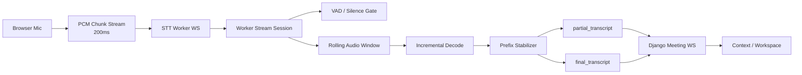

# Streaming STT Worker Design

## 目标

本设计只面向 `workspace STT` 的近实时字幕链路，不面向 `实时语音助手`。

目标：

- 将当前 `PCM chunk -> finalize() 后一次性识别` 升级成真正的 near-realtime STT
- 在会中持续输出较稳定的 `partial_transcript`
- 在静音或语句边界输出 `final_transcript`
- 保持 Django / Flutter 协议不破坏式演进
- 不污染实时语音助手的低时延语音对话状态机

非目标：

- 不把 worker 改造成实时语音助手的音频 ingress
- 不在本轮引入复杂分布式队列
- 不追求 token 级别字幕刷新

## 当前现状

当前链路已经具备：

- Flutter 侧 `workspace_stt/` 独立子目录
- 浏览器 PCM 采集、重采样、PCM16 编码、固定 chunk 发送
- websocket `audio_chunk` 协议兼容 `audio/pcm;rate=16000`
- worker 侧能够接收 PCM 并转成 WAV 后喂给 `faster-whisper`
- `finalize()` 已不再在已有 partial decode 后重复触发一次全量转写
- `StreamingState` 已支持 `pending + overlap` 的窗口化 decode 基础设施

当前瓶颈：

- `partial decode` 仍是同步阻塞式
- `faster-whisper` 仍未做到严格意义上的新增段增量识别
- 窗口文本拼接策略还比较初级
- 用户体感仍未达到理想的 near-realtime 字幕

## 设计原则

1. 识别状态机只存在于 `services/stt_worker/`
2. Flutter 只负责采集和展示，不做句子稳定化判断
3. Django 只负责 transcript 持久化与工作区编排，不做流式 ASR 算法
4. partial 可以不完美，但必须单调稳定，不能频繁大幅抖动

## 目标架构



## Worker 内部模块

建议新增以下边界：

```text
services/stt_worker/stt_worker/
  pipeline/
    stream_session.py
    streaming_state.py
    transcript_stabilizer.py
    silence_gate.py
  providers/
    faster_whisper_provider.py
```

职责：

- `stream_session.py`
  - websocket 级 session 生命周期
  - 接收 chunk
  - 推动状态机
- `streaming_state.py`
  - 维护滚动音频窗口
  - 维护累计音频长度、最后解码时间、segment 状态
- `transcript_stabilizer.py`
  - 比较上一次识别结果和当前识别结果
  - 产出稳定前缀和波动尾巴
- `silence_gate.py`
  - 基于静音时长、最短语句长度决定何时 finalize

## 状态机

建议状态：

- `idle`
- `listening`
- `speech_active`
- `speech_trailing_silence`
- `segment_finalizing`

状态推进：

1. `start`
   - 初始化 session
   - 清空音频缓冲和文本状态
2. `audio_chunk`
   - 追加 PCM 数据
   - 更新音量 / 静音窗口
   - 满足最小增量窗口时触发一次 decode
   - decode 输入为 `pending + overlap` 窗口，而不是完整累计 buffer
3. `partial emit`
   - 只在稳定文本明显增长时发
4. `finalize`
   - 检测到静音边界或 `stop`
   - 优先复用最近一次 partial decode 结果
   - 不再默认追加一次全量 decode
   - 输出 final transcript
   - 清空 segment 级缓冲

## 推荐参数

首版先保守：

- 输入 chunk：`200ms`
- decode 触发步长：`800ms`
- decode overlap：`1000ms`
- rolling window：`6s`
- 最小可发 partial：`>= 2` 个汉字或 `>= 1` 个英文词
- trailing silence finalize：`900ms ~ 1200ms`
- stop 强制 finalize：立即

原因：

- decode 太频繁会让 CPU 抖动明显
- window 太大会拉高延迟
- 先用秒级稳定 partial，比高频抖动 partial 更重要

## Partial 稳定化策略

首版不做复杂 token 对齐，采用“最长公共前缀 + 波动尾巴”。

输入：

- 上一次 decode 文本 `prev`
- 当前 decode 文本 `curr`

处理：

1. 求 `prev` 和 `curr` 的最长公共前缀
2. 将公共前缀视为稳定前缀
3. 将 `curr` 余下部分视为波动尾巴
4. 只有稳定前缀增长超过阈值时才发新的 partial
5. final 时直接发送最终全文

输出规则：

- `partial_transcript.text = stable_prefix + unstable_suffix`
- 但 UI 可以只把新增稳定部分沉淀进当前临时行

## VAD / 静音策略

首版优先简单实现，不强依赖神经 VAD。

Phase A：

- 直接基于 PCM RMS 能量阈值
- 连续低于阈值达到 `trailing_silence_ms` 时 finalize

Phase B：

- 可选接入 `silero-vad`
- 用于更稳的语句边界判断

这样做的原因：

- RMS silence gate 容易测试和调参
- 先把 streaming 状态机打通，再追求边界精度

## Provider 改造

`FasterWhisperRealtimeProvider` 需要从“buffer then finalize”升级为：

- `push_chunk()` 只负责累计 PCM 与更新状态
- `decode_partial(window_bytes)` 对窗口音频做转写
- `finalize()` 优先复用最近一次 partial transcript

当前已落地：

- `decode_partial(audio_window)` 支持显式传入窗口
- `StreamingState.mark_decoded()` 返回 `pending + overlap` 窗口，而不是完整累计 buffer
- `finalize()` 在已有 partial decode 结果时不再触发第二次全量转写

注意：

- 不必让 provider 自己管理 websocket session
- session 状态机仍应在 `pipeline/stream_session.py`

## 性能结论更新

基于真实 `faster-whisper tiny/int8 + CPU` 的本地压测，在 `1.0s speech + 0.6s silence` 输入上：

- 旧实现：`final_p50` 约 `20.0s`
- 去掉 `final` 二次全量 decode 后：`final_p50` 约 `14.3s`

这说明：

- `final` 重转确实是明显浪费
- 但更大的瓶颈仍在于多次 `partial decode` 的重复工作
- 下一阶段重点应放在“窗口化增量 decode + 更合理的文本拼接”

## 协议演进

出站协议保持不变：

- `start`
- `audio_chunk`
- `stop`

入站协议建议扩展但保持兼容：

- `session_started`
- `partial_transcript`
- `final_transcript`
- `error`

可增加字段：

- `segment_id`
- `is_final`
- `latency_ms`
- `stable_chars`

## TDD 顺序

1. `silence_gate.py`
   - 测试静音窗口判断
2. `transcript_stabilizer.py`
   - 测试公共前缀与稳定化行为
3. `streaming_state.py`
   - 测试滚动窗口和 decode 调度
4. `stream_session.py`
   - 测试 `audio_chunk -> partial -> final`
5. provider 集成测试
   - 测试 PCM / WAV / 增量 decode 路径

## 里程碑

### Milestone 1

- 真实 partial transcript 不再只是占位
- stop 时 final transcript 仍保持正确

### Milestone 2

- 静音自动 finalize
- 会中不用手动 stop 也能持续形成 final transcript

### Milestone 3

- 更稳定的 partial
- 更低 CPU 抖动
- 用窗口增量 decode 替代累计全量 decode

## 本轮建议实施范围

下一轮开发优先做：

- `silence_gate.py`
- `transcript_stabilizer.py`
- `stream_session.py` 的增量状态机

暂不做：

- `AudioWorklet` 替换当前 `ScriptProcessorNode`
- 多模型 provider 路由
- 自动派发策略细化
