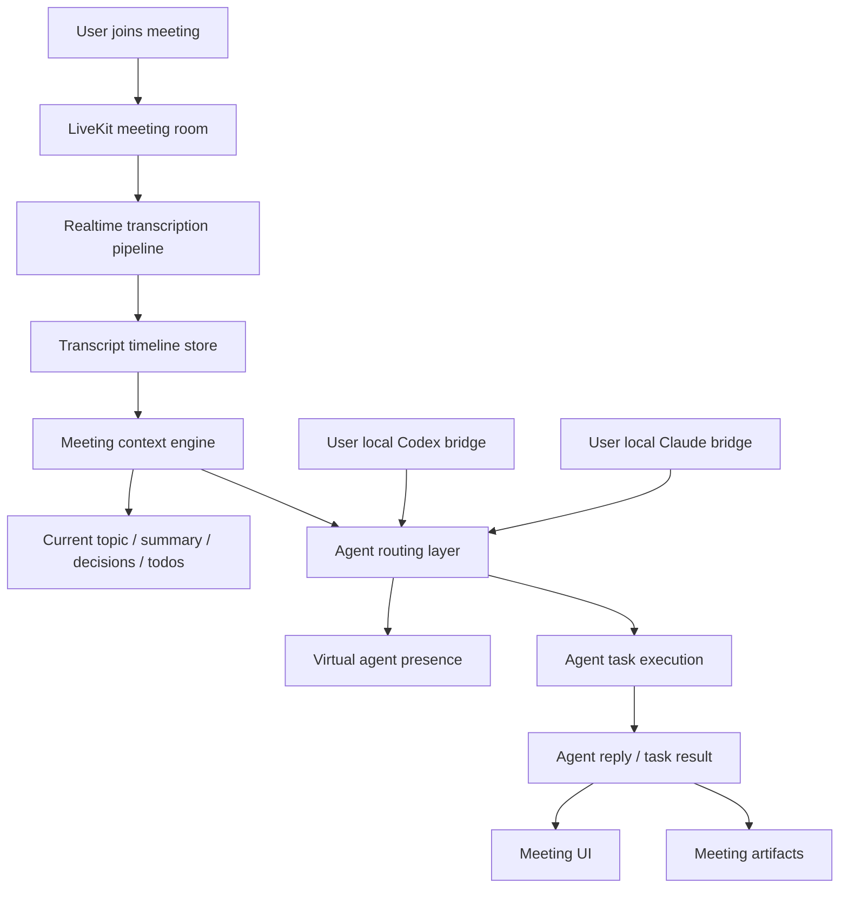
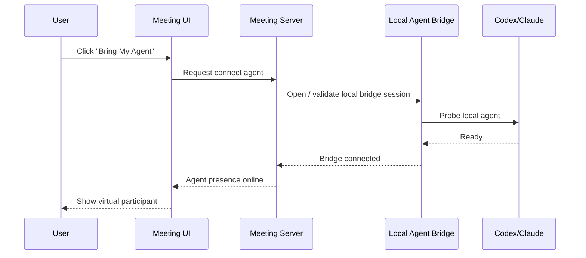
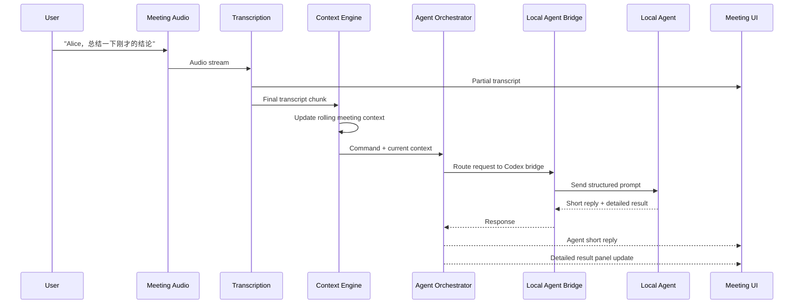
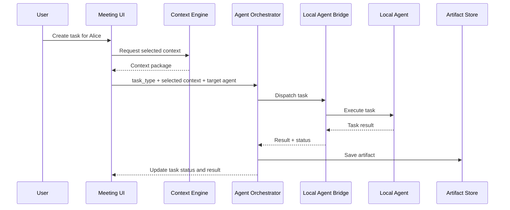

# 虚拟 Agent 参会设计方案

## 当前实现状态

这份文档描述的是“虚拟 Agent 参会”的**目标产品方案**，不是当前仓库已经完成的能力。

当前 Git 代码实际情况：

- 已有一个会议页工作区，用于展示 transcript / context / artifact
- transcript 目前主要靠手动录入 API 驱动
- agent action 目前主要是工作区里的任务触发接口
- agent session 只是后端状态对象，不是真正的实时虚拟参会者
- 当前没有实时 STT 落地实现
- 当前没有真实的本地 Codex / Claude bridge 落地实现
- 当前没有 Agent 通过语音直接参与会议的能力

可以把当前状态理解成：

- 已实现：`meeting_context workspace MVP`
- 未实现：`virtual agent in meeting`

下面内容是后续设计目标。

## 1. 目标

本方案的目标不是在会议页里增加一个聊天机器人，而是让用户可以把自己的本地 Agent 作为“虚拟参会者”带入会议。

目标能力：

1. 用户进入会议后，可以轻松连接自己的本地 `Codex` 或 `Claude`
2. 会议具备实时转录能力
3. 用户可以通过语音或文本直接与 Agent 交流
4. Agent 能持续感知会议上下文，而不是只看到单条消息
5. 用户可以在会中给 Agent 安排轻任务，Agent 现场反馈结果
6. Agent 的结果可以沉淀为会议产物

一句话定义：

**VibeMeeting = 支持实时转录和上下文感知的会议空间，用户可以把自己的本地 Agent 带入会场，与其对话、交办任务并即时获得结果。**

## 2. 产品定位

### 2.1 和飞书 / cc-connect 的区别

飞书机器人适合：

- 会外异步私聊
- 单轮问答
- 低上下文依赖的临时请求

本产品适合：

- 会中实时协作
- 多人共享上下文
- 基于会议内容的即时分析、总结和任务分派
- 会后沉淀为结构化资产

区别不是“能不能问 AI”，而是：

- 飞书：`我和 AI 对话`
- VibeMeeting：`AI 参与这场会`

## 3. 核心使用场景

### 场景 A：Agent 作为虚拟参会者

1. 用户获得会议链接并打开
2. 用户加入会议
3. 用户点击 `Bring My Agent`
4. 用户选择连接自己的 `Codex` 或 `Claude`
5. Agent 以虚拟参会者身份出现在参会者列表中
6. 用户可以直接对 Agent 说话

示例：

- `Alice，总结一下刚才的结论`
- `Bob，把这个需求拆成开发任务`
- `Alice，起一个接口草案`

### 场景 B：会中安排轻任务

用户在讨论过程中把轻任务直接交给 Agent：

- 会议总结
- 风险分析
- 待办提取
- 技术方案草案
- API 草案
- 代码任务拆分

Agent 在会中先给短反馈，再返回详细结果。

### 场景 C：结果沉淀

Agent 输出的结果不能只停留在对话里，还需要沉淀为：

- Summary
- Decision Log
- Todos
- Code Tasks

## 4. 设计原则

1. Agent 是参会者，不是聊天框
2. 会议上下文优先于单条输入
3. 语音交流是主体验之一，但底层仍以文本上下文驱动
4. 会中短反馈 + 侧边栏详细结果分层展示
5. 本地 Agent 连接能力复用已有 bridge

## 5. 目标总体架构

## 6. 目标系统分层

### 6.1 Meeting Runtime Layer

职责：

- 会议加入与媒体流
- 参会者管理
- Agent 参会状态呈现

依赖：

- LiveKit

### 6.2 Realtime Transcription Layer

职责：

- 持续接收会议音频
- 转成增量 transcript
- 区分 partial / final

输出：

- `MeetingTranscriptChunk`

### 6.3 Meeting Context Engine

职责：

- 基于最近 N 分钟转录构建上下文
- 提取：
  - 当前议题
  - 近期摘要
  - 决策草稿
  - 待办草稿
  - 未解决问题

这是 Agent 的主要上下文输入源。

### 6.4 Agent Presence + Routing Layer

职责：

- 每个用户连接自己的本地 Agent
- 把 Agent 作为“虚拟参会者”接入
- 识别点名和任务分配
- 统一调用本地 `Codex / Claude`

### 6.5 Artifact Layer

职责：

- 保存 Agent 输出
- 形成会议产物
- 支持后续导出/同步

## 7. 目标关键模块设计

建议新增独立模块：

- `conference/meeting_context/`

建议内部拆分：

- `models.py`
  - `MeetingTranscriptChunk`
  - `MeetingContextSnapshot`
  - `MeetingAgentTask`
  - `MeetingArtifact`
- `services/ingest.py`
  - transcript 写入
- `services/context.py`
  - 上下文构建
- `services/presence.py`
  - 虚拟 Agent 状态
- `services/orchestrator.py`
  - 路由到 Codex / Claude
- `services/materialize.py`
  - 生成摘要/待办/决策
- `views.py`
  - transcript/context/actions/artifacts API

目标上希望复用的模块：

- `conference/speech_to_text/`
  - 目标上负责音频 -> 文本
  - 当前仓库无有效实现
- `conference/speech_agent/services/bridge.py`
  - 目标上负责调用本地 Agent
  - 当前仓库无有效实现

需要调整定位：

- `speech_to_text` 不负责产品交互
- `bridge` 不负责 prompt 设计
- 当前已存在的 `meeting_context` 模块只覆盖了轻量 workspace MVP
- 后续再演进成“会议上下文 -> Agent”主逻辑

## 8. 数据模型

### 8.1 MeetingTranscriptChunk

字段建议：

- `meeting`
- `speaker_identity`
- `speaker_name`
- `source`
- `text`
- `start_ms`
- `end_ms`
- `is_final`
- `confidence`
- `sequence_no`
- `created_at`

### 8.2 MeetingContextSnapshot

字段建议：

- `meeting`
- `window_start_ms`
- `window_end_ms`
- `topic_label`
- `summary_text`
- `open_questions_json`
- `decisions_json`
- `todos_json`
- `source_chunk_ids_json`
- `version`
- `created_at`

### 8.3 MeetingAgentTask

字段建议：

- `meeting`
- `requested_by`
- `agent_type`
- `task_type`
- `trigger_mode`
- `context_snapshot`
- `selected_chunk_ids_json`
- `prompt_body`
- `response_body`
- `status`
- `latency_ms`
- `created_at`

### 8.4 MeetingArtifact

字段建议：

- `meeting`
- `artifact_type`
- `content`
- `source_snapshot`
- `created_by_agent_type`
- `version`
- `created_at`
- `updated_at`

## 9. 交互设计

### 9.1 主界面布局

- 左侧：`Live Transcript`
- 中间：`Stage + Current Topic`
- 右侧：`My Agents + Task Results`

右侧建议按 Agent 维度组织，而不是按聊天消息组织。

每个 Agent 都应有自己的工作面板：

- `Dashboard`
- `Notebook`

### 9.2 Agent 作为参会者展示

Agent 在参会者列表中显示为：

- `Alice (Codex) - Listening`
- `Bob (Claude) - Working`

状态包括：

- `idle`
- `listening`
- `thinking`
- `working`
- `done`
- `error`

### 9.3 Agent Dashboard 定义

这里的 `dashboard` 不是 BI 看板，也不是管理员后台。

定义：

**Agent Dashboard 是面向会议参与者的实时工作台，用来展示某个虚拟 Agent 的当前状态、上下文、任务、输出和健康信息。**

它的目标只有两个：

1. 让人知道这个 Agent 现在在干什么
2. 让人可以继续和这个 Agent 协作，而不必猜它的内部状态

Dashboard 不是：

- 传统数据分析面板
- 纯聊天窗口
- 长期知识库

Dashboard 是：

- 当前会议里的 Agent runtime panel

#### 9.3.1 Dashboard 核心信息

每个 Agent Dashboard 至少包含 5 类信息。

##### A. Presence

表示 Agent 当前是否“在场”：

- `offline`
- `connecting`
- `idle`
- `listening`
- `thinking`
- `working`
- `done`
- `error`

##### B. Current Context

表示 Agent 当前基于什么会议内容在工作：

- 当前议题
- 最近关注的 transcript 片段
- 触发它工作的用户
- 当前上下文窗口

##### C. Task State

表示 Agent 当前和最近的任务状态：

- 当前任务
- 排队中的任务
- 最近完成任务
- 最近失败任务

##### D. Outputs

表示 Agent 最近产出的结果：

- 短反馈
- 详细结果
- Summary
- Todo
- API 草案
- 风险清单

##### E. Health

表示 Agent 的运行健康状态：

- 本地 bridge 是否在线
- 最近调用耗时
- 最后一次成功时间
- 最近错误次数

#### 9.3.2 Dashboard 字段建议

建议增加一类运行时状态对象：

- `agent_type`
- `display_name`
- `presence_status`
- `current_topic`
- `current_task_title`
- `current_task_status`
- `current_context_chunk_ids_json`
- `latest_short_reply`
- `latest_result_artifact_id`
- `queue_size`
- `bridge_online`
- `last_latency_ms`
- `last_error`
- `updated_at`

#### 9.3.3 Dashboard 页面结构

每个 Agent 在 UI 中建议有独立卡片或独立 tab。

页面结构建议：

- Agent name
- Presence badge
- Current task
- Current context summary
- Latest short reply
- Recent outputs
- Health info
- Quick actions

Quick actions 示例：

- `Ask`
- `Assign Task`
- `Summarize`
- `Pause`
- `Save to Notebook`

### 9.4 Agent Notebook 定义

Notebook 是 Agent 的长期记忆层，不是实时状态层。

定义：

**Agent Notebook 是某个虚拟 Agent 的持久化工作笔记与长期记忆，用来保存会议结论、项目背景、历史决策、待办和偏好信息。**

Dashboard 和 Notebook 的关系：

- Dashboard = 当前状态
- Notebook = 长期记忆

Notebook 可以是外部系统：

- Notion
- Obsidian
- 飞书文档
- 本地 Markdown 仓库

建议架构上抽象成 `Notebook Provider`，不要写死具体实现。

#### 9.4.1 Notebook Provider 接口建议

统一抽象动作：

- `append_note`
- `update_page`
- `search_notes`
- `load_context`
- `link_artifact`

#### 9.4.2 Notebook 的作用

Notebook 主要承载：

- 项目背景
- 历史决策
- 会议纪要
- 待办演进
- 技术草案
- 用户偏好

#### 9.4.3 Dashboard 和 Notebook 联动

标准链路：

1. Agent 在会中接到任务
2. 结果先显示在 Dashboard
3. 用户确认后写入 Notebook
4. 后续会议再从 Notebook 中取回背景

### 9.5 会中交流模式

支持两种方式：

1. 语音点名
   - `Alice，帮我总结刚才这段`
   - `Bob，把这段讨论拆成待办`

2. 文本 @agent
   - `@Alice 给一个接口草案`
   - `@Bob 解释下刚才的风险`

### 9.6 回答分层

Agent 输出分两层：

1. `短反馈`
   - 用于会中交流
   - 例如：`收到，我来整理`

2. `详细结果`
   - 展示在右侧面板
   - 例如：总结全文、待办列表、API 草案

### 9.7 右侧面板建议结构

右侧面板建议按 Agent 分栏，而不是按聊天消息堆叠。

例如：

- `Alice / Codex`
  - `Dashboard`
  - `Notebook`
  - `Outputs`
- `Bob / Claude`
  - `Dashboard`
  - `Notebook`
  - `Outputs`

## 10. 关键时序

### 10.1 用户连接本地 Agent

### 10.2 会中点名 Agent 并立即回复

### 10.3 会中交办轻任务

## 11. Prompt 设计原则

前端不拼复杂 prompt。

后端统一由 `orchestrator.py` 组织：

- 当前会议主题
- 最近摘要
- 相关 transcript 片段
- 当前用户指令
- 当前任务类型

建议 prompt 结构：

1. 会议元信息
2. 最近上下文摘要
3. 选中 transcript 片段
4. 用户命令
5. 输出格式要求

## 12. MVP 范围

第一版建议只做最小闭环：

1. 用户连接本地 `Codex / Claude`
2. 页面显示虚拟 Agent 参会状态
3. 实时 transcript
4. 识别 `Alice / Bob` 点名
5. 支持 Agent 短回复
6. 支持 3 类轻任务：
   - 总结
   - 提取待办
   - 生成技术草案
7. 支持结果落地到右侧结果面板

暂不做：

- 复杂 TTS 回播
- 多 Agent 自动协作对话
- 重任务长时执行编排
- 完整 IM 历史系统替代

## 13. 风险与取舍

### 风险 1：语音直通 Agent 不稳定

结论：

- 不做音频裸传给 Agent
- 始终以 transcript + context 驱动

### 风险 2：上下文膨胀

结论：

- 只保留最近窗口
- 使用 `MeetingContextSnapshot` 做压缩

### 风险 3：会中回复过长打断会议

结论：

- Agent 只在主会场给短反馈
- 长结果落侧边栏

### 风险 4：产品退化成聊天机器人

结论：

- 主入口是 `Bring My Agent`
- 主交互是点名 / 分派任务 / 查看结果
- 不是自由聊天框

## 14. 实施顺序

### Phase 1：虚拟参会者闭环

- 实现 `Bring My Agent`
- 实现本地 bridge 连接状态
- 实现参会者列表里的 Agent presence

### Phase 2：上下文闭环

- 实现 transcript timeline
- 实现 context snapshot
- 实现点名识别

### Phase 3：任务闭环

- 实现轻任务模型
- 实现 Claude / Codex 任务路由
- 实现 artifact 落盘

## 15. 结论

本方案的关键不是把会议聊天框升级成语音聊天框，而是把本地 Agent 升级成真正的虚拟参会者。

这样用户获得的是：

- 一个能带自己 Agent 进会的会议空间
- 一个能让 Agent 持续听懂会议上下文的工作台
- 一个可以在会中即时给 Agent 安排轻任务并拿到结果的协作系统

这才是区别于飞书机器人和普通会议产品的核心价值。
