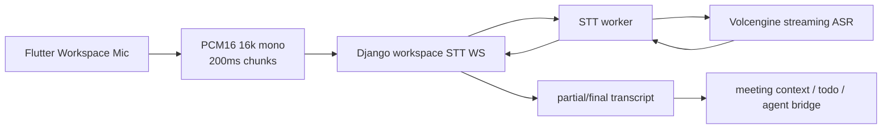
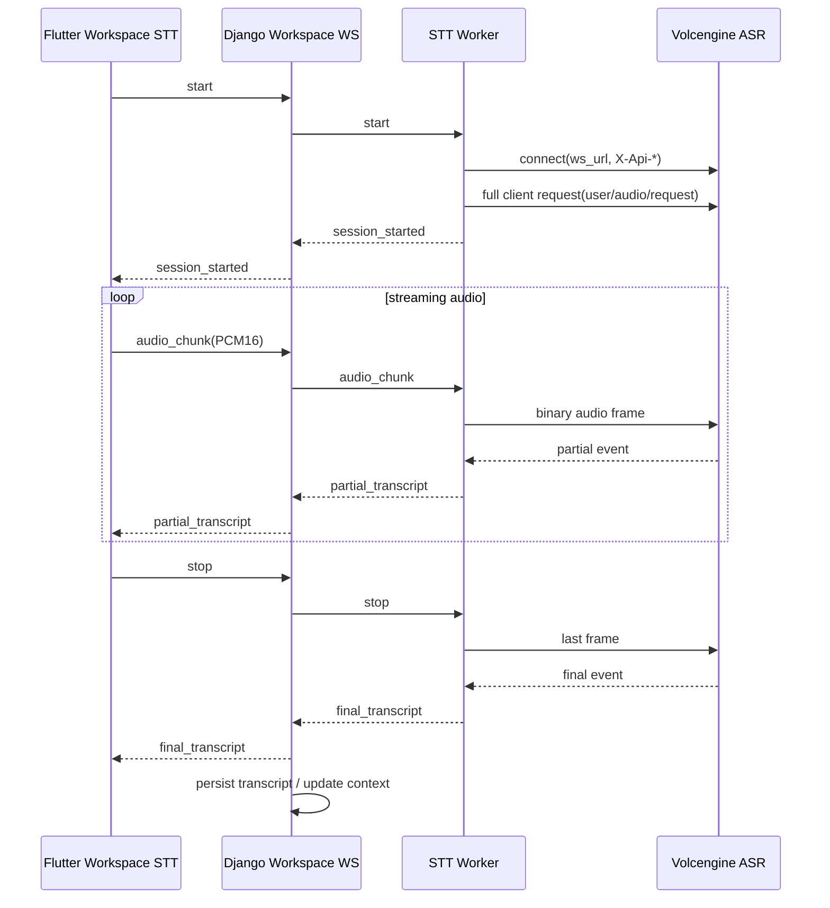

# Volcengine Cloud STT Design

## 目标

本设计只覆盖 `会议工作区` 的近实时转写通路。

目标：

- 用火山引擎 `流式语音识别大模型` 替代本地 `faster-whisper` 作为工作区 STT 主识别器
- 保持 Flutter 工作区采集链路不变，继续上传 `PCM16 / 16k / mono`
- 保持与 `实时语音助手` 的语音到语音链路彻底解耦
- 保持 Django 的 transcript/context/todo/agent bridge 编排边界不变

非目标：

- 不改实时语音助手的豆包语音对话链路
- 不在本轮实现自动派单
- 不做向旧的错误火山接入假设兼容

## 接入假设

当前云端 STT 接入只按用户拍板的官方文档推进：

- 文档：`https://www.volcengine.com/docs/6561/1354869?lang=zh`

基于该文档标题、官方搜索摘要以及当前代码接入假设，收敛为以下最小协议面：

- WebSocket 地址：`wss://openspeech.bytedance.com/api/v3/sauc/bigmodel`
- 握手头：
  - `X-Api-App-Key`
  - `X-Api-Access-Key`
  - `X-Api-Resource-Id`
  - `X-Api-Connect-Id`
- 必填配置：
  - `appid`
  - `access_token`
  - `resource_id`
- 当前默认 `resource_id`：
  - `volc.bigasr.sauc.duration`
- 输入音频格式：
  - `pcm`
  - `raw`
  - `16k`
  - `16bit`
  - `mono`
- 首包请求体最小字段：
  - `user.uid`
  - `audio.format/rate/bits/channel/language`
  - `request.reqid`
  - `request.resource_id`
  - `request.model_name=bigmodel`
  - `request.enable_itn`
  - `request.enable_ddc`
  - `request.enable_punc`
- 返回包当前已验证：
  - 服务端返回 `V1 binary protocol`
  - `payload` 是未压缩 JSON
  - 文本位于 `payload.result.text`

说明：

- 这里不再把 `cluster` 作为配置输入，也不再走旧的 `api/v2/asr` 假设。
- 若后续拿到 `1354869` 页面的更完整字段定义，再在当前实现上精修，不回滚到旧路线。

## 架构边界

## 模块职责

### Flutter

目录：

- `flutter_app/lib/meeting_room/workspace_stt/`

职责：

- 采集浏览器麦克风
- 下采样与编码为 `PCM16`
- 发送 `start / audio_chunk / stop`
- 显示 `partial_transcript / final_transcript`

不负责：

- 云端鉴权
- 火山私有协议适配
- transcript 稳定化

### Django

目录：

- `conference/speech_to_text/`

职责：

- 认证用户与校验会议权限
- 将浏览器 STT 消息转发到 worker
- 接收统一 transcript 事件
- 持久化 final transcript
- 将 final transcript 接入 context/workspace

### STT worker

目录：

- `services/stt_worker/stt_worker/providers/volcengine_realtime_provider.py`

职责：

- 建立到火山 WebSocket 的上游连接
- 构造 full client request 与音频 frame
- 将统一 worker 协议映射到火山二进制协议
- 将后续上游响应映射回 `partial_transcript / final_transcript`

## 当前实现状态

已经完成：

- provider 配置切到 `appid + access_token + resource_id + ws_url`
- 默认 WS 地址切到 `wss://openspeech.bytedance.com/api/v3/sauc/bigmodel`
- 去掉 `cluster` 配置依赖
- 已切到 `X-Api-*` 握手头
- `start_session` 会发送真实 `V1 binary` full client request
- `push_chunk` 会发送真实 `V1 binary` audio-only request
- `finalize` 会发送 last audio request 并关闭连接
- 已能解析真实服务端 `full server response` / `error response`
- 已验证服务端文本位于 `payload.result.text`
- provider / config / session builder 已有自动化测试覆盖

当前还没完成：

- 用真实语音样本跑出非空 partial/final transcript
- 验证更完整的异常码和边界条件
- 端到端挂进 Django workspace 通路再联调一次

因此当前状态仍是：

- 协议骨架和返回包解析都已就位
- 配置面已收敛到 `1354869`
- 真 key 直连已验证可握手并可收包
- 当前剩下的是“用真实语音样本打通非空转写结果”

## 时序

## 配置

`.env` / `.env.example` 当前需要：

- `STT_WORKER_PROVIDER=volcengine_realtime`
- `STT_WORKER_VOLCENGINE_APP_ID=...`
- `STT_WORKER_VOLCENGINE_ACCESS_TOKEN=...`
- `STT_WORKER_VOLCENGINE_RESOURCE_ID=volc.bigasr.sauc.duration`
- `STT_WORKER_VOLCENGINE_WS_URL=wss://openspeech.bytedance.com/api/v3/sauc/bigmodel`

保留 fallback：

- `STT_WORKER_PROVIDER=faster_whisper`

## 测试策略

当前自动化覆盖：

- provider 配置读取
- `X-Api-*` 握手头构造
- full request payload 结构
- start / chunk / finalize 的 `V1 binary` 发送行为
- full server response / error response 解析
- stream session 对 provider 的参数透传

后续要补：

- 非空 transcript 的真实样本回归测试
- 更多错误码与鉴权失败路径
- 真实 WebSocket mock 集成测试

## 推荐推进顺序

1. 保持 `faster-whisper` 可用作为 fallback
2. 完成火山服务端返回包解析
3. 做真实账号联调
4. 再把该 provider 提升为工作区 STT 默认主路径
